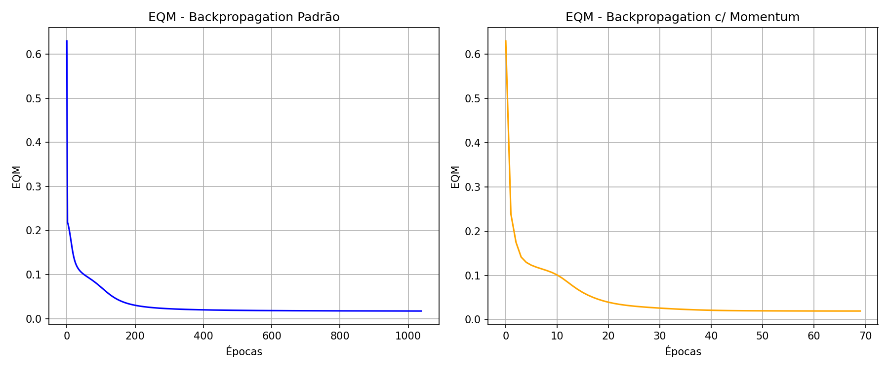

# Centro Federal de Educação Tecnológica de Minas Gerais
**Campus VIII – Varginha**  
**Bacharelado em Sistemas de Informação**  
**Disciplina:** Lab. Inteligência Artificial  
**Professor:** Lázaro Eduardo da Silva  
**Data:** 14/05/2026  
**Aluno(a):** Álvaro Henrique Duarte Mendes  
**Valor:** 100% | **Nota:** _______

---

## Atividade 04 - PMC

Para o processamento de bebidas, a equipe de engenheiros resolveu aplicar uma rede perceptron multicamadas como classificadora de padrões, visando identificar qual conservante (A, B ou C) será aplicado em determinado lote de bebida com base em 4 variáveis (teor de água, grau de acidez, temperatura e tensão superficial). A rede possui topologia 4-15-3.

### 1 e 2. Treinamentos da Rede Perceptron

Foram executados treinamentos utilizando Backpropagation Padrão e Backpropagation com Momentum.
As matrizes de pesos foram inicializadas com valores aleatórios entre 0 e 1, utilizou-se a função logística, taxa de aprendizado $\eta = 0.1$, fator de momentum $\alpha = 0.9$ e precisão $\epsilon = 10^{-6}$.

| Algoritmo | Erro Quadrático Médio (EQM) | Número de Épocas | Tempo de Processamento (s) |
|:---|:---:|:---:|:---:|
| Backpropagation Padrão | 0.017217 | 1038 | 3.4010 |
| Backpropagation c/ Momentum | 0.019157 | 69 | 0.2732 |

### 3. Gráficos do Erro Quadrático Médio (EQM)

Os gráficos também estão disponíveis no notebook `PMC.ipynb`.

### 4 e 5. Validação da Rede

O pós-processamento das saídas para valores discretos foi feito usando o arredondamento simétrico, de forma a classificar a amostra em um dos 3 tipos de conservante (Tipo A: 1 0 0, Tipo B: 0 1 0, Tipo C: 0 0 1).

| Amostra | x1 | x2 | x3 | x4 | Desejado (d1, d2, d3) | Padrão (y1, y2, y3) | Momentum (y1, y2, y3) |
|:---:|:---:|:---:|:---:|:---:|:---:|:---:|:---:|
| **1** | 0.8622 | 0.7101 | 0.6236 | 0.7894 | 0, 0, 1 | 0, 0, 1 | 0, 0, 1 |
| **2** | 0.2741 | 0.1552 | 0.1333 | 0.1516 | 1, 0, 0 | 1, 0, 0 | 1, 0, 0 |
| **3** | 0.6772 | 0.8516 | 0.6543 | 0.7573 | 0, 0, 1 | 0, 0, 1 | 0, 0, 1 |
| **4** | 0.2178 | 0.5039 | 0.6415 | 0.5039 | 0, 1, 0 | 0, 1, 0 | 0, 1, 0 |
| **5** | 0.7260 | 0.7500 | 0.7007 | 0.4953 | 0, 0, 1 | 0, 0, 1 | 0, 0, 1 |
| **6** | 0.2473 | 0.2941 | 0.4248 | 0.3087 | 1, 0, 0 | 1, 0, 0 | 1, 0, 0 |
| **7** | 0.5682 | 0.5683 | 0.5054 | 0.4426 | 0, 1, 0 | 0, 1, 0 | 0, 1, 0 |
| **8** | 0.6566 | 0.6715 | 0.4952 | 0.3951 | 0, 1, 0 | 0, 1, 0 | 0, 1, 0 |
| **9** | 0.0705 | 0.4717 | 0.2921 | 0.2954 | 1, 0, 0 | 1, 0, 0 | 1, 0, 0 |
| **10** | 0.1187 | 0.2568 | 0.3140 | 0.3037 | 1, 0, 0 | 1, 0, 0 | 1, 0, 0 |
| **11** | 0.5673 | 0.7011 | 0.4083 | 0.5552 | 0, 1, 0 | 0, 1, 0 | 0, 1, 0 |
| **12** | 0.3164 | 0.2251 | 0.3526 | 0.2560 | 1, 0, 0 | 1, 0, 0 | 1, 0, 0 |
| **13** | 0.7884 | 0.9568 | 0.6825 | 0.6398 | 0, 0, 1 | 0, 0, 1 | 0, 0, 1 |
| **14** | 0.9633 | 0.7850 | 0.6777 | 0.6059 | 0, 0, 1 | 0, 0, 1 | 0, 0, 1 |
| **15** | 0.7739 | 0.8505 | 0.7934 | 0.6626 | 0, 0, 1 | 0, 0, 1 | 0, 0, 1 |
| **16** | 0.4219 | 0.4136 | 0.1408 | 0.0940 | 1, 0, 0 | 1, 0, 0 | 1, 0, 0 |
| **17** | 0.6616 | 0.4365 | 0.6597 | 0.8129 | 0, 0, 1 | 0, 0, 1 | 0, 0, 1 |
| **18** | 0.7325 | 0.4761 | 0.3888 | 0.5683 | 0, 1, 0 | 0, 1, 0 | 0, 1, 0 |

**Taxa de Acerto - Backpropagation Padrão:** 100.00%  
**Taxa de Acerto - Backpropagation c/ Momentum:** 100.00%
