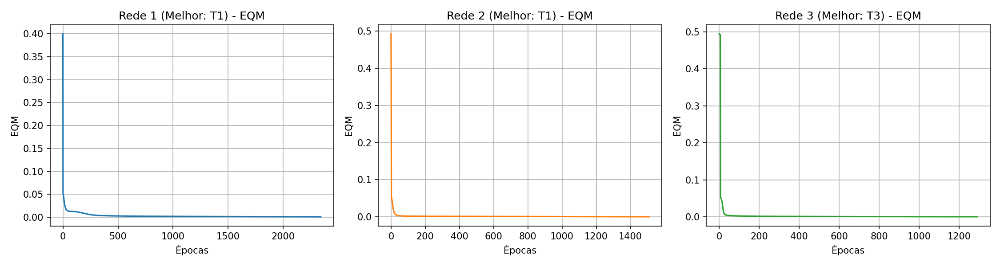
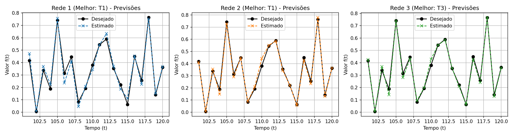

# Centro Federal de Educação Tecnológica de Minas Gerais
**Campus VIII – Varginha**  
**Bacharelado em Sistemas de Informação**  
**Disciplina:** Lab. Inteligência Artificial  
**Professor:** Lázaro Eduardo da Silva  
**Data:** 14/05/2026  
**Aluno(a):** Álvaro Henrique Duarte Mendes  
**Valor:** 100% | **Nota:** _______

---

## Atividade 05 - PMC (TDNN)

O objetivo desta atividade é prever o comportamento futuro de uma série temporal do mercado financeiro utilizando uma rede neural perceptron multicamadas com topologia "Time Delay" (TDNN).

Foram testadas três topologias candidatas, variando o número de entradas $p$ (janela de tempo) e o número de neurônios na camada oculta $N1$:
- **Rede 1**: $p = 5$ entradas, $N1 = 10$ neurônios.
- **Rede 2**: $p = 10$ entradas, $N1 = 15$ neurônios.
- **Rede 3**: $p = 15$ entradas, $N1 = 25$ neurônios.

### 1 e 2. Treinamentos Realizados

Para cada rede, efetuou-se 3 treinamentos utilizando Backpropagation com Momentum. As matrizes de pesos foram inicializadas aleatoriamente, ativadas via função logística (sigmoid).
Parâmetros: $\eta = 0.1$, $\alpha = 0.8$, $\epsilon = 0.5 \times 10^{-6}$.

| Treinamento | Rede 1 (EQM) | Rede 1 (Épocas) | Rede 2 (EQM) | Rede 2 (Épocas) | Rede 3 (EQM) | Rede 3 (Épocas) |
|:---:|:---:|:---:|:---:|:---:|:---:|:---:|
| **1º (T1)** | 0.001144 | 2341 | 0.000550 | 1508 | 0.000650 | 1371 |
| **2º (T2)** | 0.001031 | 2074 | 0.000560 | 1529 | 0.494494 | 1 |
| **3º (T3)** | 0.001048 | 2684 | 0.000553 | 1105 | 0.000546 | 1289 |

### 3. Validação da Rede (Conjunto de Teste: t=101 a 120)

| Amostra | Desejado f(t) | Rede 1 (T1) | Rede 1 (T2) | Rede 1 (T3) | Rede 2 (T1) | Rede 2 (T2) | Rede 2 (T3) | Rede 3 (T1) | Rede 3 (T2) | Rede 3 (T3) |
|:---:|:---:|:---:|:---:|:---:|:---:|:---:|:---:|:---:|:---:|:---:|
| **t = 101** | 0.4173 | 0.4711 | 0.4575 | 0.4708 | 0.4102 | 0.4116 | 0.4119 | 0.4392 | 1.0000 | 0.4257 |
| **t = 102** | 0.0062 | 0.0092 | 0.0179 | 0.0159 | 0.0087 | 0.0078 | 0.0096 | 0.0038 | 1.0000 | 0.0073 |
| **t = 103** | 0.3387 | 0.3700 | 0.3867 | 0.3764 | 0.3547 | 0.3659 | 0.3644 | 0.3765 | 1.0000 | 0.3692 |
| **t = 104** | 0.1886 | 0.2230 | 0.2271 | 0.2354 | 0.1497 | 0.1543 | 0.1562 | 0.1387 | 1.0000 | 0.1421 |
| **t = 105** | 0.7418 | 0.7567 | 0.7415 | 0.7489 | 0.7271 | 0.7212 | 0.7168 | 0.7420 | 1.0000 | 0.7396 |
| **t = 106** | 0.3138 | 0.2358 | 0.2383 | 0.2404 | 0.2912 | 0.2850 | 0.2822 | 0.2844 | 1.0000 | 0.2802 |
| **t = 107** | 0.4466 | 0.4134 | 0.4251 | 0.4242 | 0.4466 | 0.4393 | 0.4373 | 0.4289 | 1.0000 | 0.4331 |
| **t = 108** | 0.0835 | 0.0466 | 0.0665 | 0.0756 | 0.0879 | 0.0927 | 0.1006 | 0.0855 | 1.0000 | 0.0942 |
| **t = 109** | 0.1930 | 0.2078 | 0.1900 | 0.1841 | 0.2082 | 0.1977 | 0.1977 | 0.2049 | 1.0000 | 0.1985 |
| **t = 110** | 0.3807 | 0.3439 | 0.3352 | 0.3278 | 0.4413 | 0.4496 | 0.4483 | 0.4379 | 1.0000 | 0.4291 |
| **t = 111** | 0.5438 | 0.5432 | 0.5530 | 0.5492 | 0.5502 | 0.5573 | 0.5609 | 0.5512 | 1.0000 | 0.5429 |
| **t = 112** | 0.5897 | 0.6336 | 0.6291 | 0.6261 | 0.5853 | 0.5822 | 0.5727 | 0.5998 | 1.0000 | 0.5855 |
| **t = 113** | 0.3536 | 0.3706 | 0.3712 | 0.3674 | 0.3441 | 0.3538 | 0.3490 | 0.3594 | 1.0000 | 0.3555 |
| **t = 114** | 0.2210 | 0.1871 | 0.1942 | 0.2008 | 0.2216 | 0.2248 | 0.2228 | 0.2323 | 1.0000 | 0.2079 |
| **t = 115** | 0.0631 | 0.1115 | 0.1007 | 0.0965 | 0.0570 | 0.0557 | 0.0587 | 0.0565 | 1.0000 | 0.0622 |
| **t = 116** | 0.4499 | 0.4540 | 0.4637 | 0.4691 | 0.4274 | 0.4178 | 0.4203 | 0.4340 | 1.0000 | 0.4284 |
| **t = 117** | 0.2564 | 0.2256 | 0.2262 | 0.2283 | 0.2359 | 0.2381 | 0.2354 | 0.2448 | 1.0000 | 0.2396 |
| **t = 118** | 0.7642 | 0.7522 | 0.7402 | 0.7260 | 0.7797 | 0.7775 | 0.7853 | 0.7581 | 1.0000 | 0.7672 |
| **t = 119** | 0.1411 | 0.1496 | 0.1474 | 0.1461 | 0.1308 | 0.1226 | 0.1150 | 0.1402 | 1.0000 | 0.1280 |
| **t = 120** | 0.3626 | 0.3679 | 0.3628 | 0.3697 | 0.3643 | 0.3601 | 0.3603 | 0.3500 | 1.0000 | 0.3591 |
| **Erro Relativo Médio (%)** | | 15.5318 | 20.1508 | 18.0443 | 7.1299 | 7.2774 | 9.4082 | 7.5886 | 1112.5357 | 6.3535 | 
| **Variância (%)** | | 361.6514 | 1659.9091 | 1134.0632 | 83.6164 | 48.6633 | 144.9100 | 87.7186 | 11837738.6897 | 43.3451 | 

### 4. Gráficos do Erro Quadrático Médio (EQM) para o Melhor Treinamento

Considerando o menor Erro Relativo Médio de cada topologia, foram gerados os gráficos:

### 5. Gráficos de Previsão (Desejado vs Estimado) para o Melhor Treinamento

### 6. Conclusão

Baseado nas análises das tabelas e gráficos, a topologia mais adequada para a realização de previsões neste processo é a **Rede 3**, utilizando a configuração do **Treinamento T3**. Esta configuração alcançou o menor Erro Relativo Médio no conjunto de teste, evidenciando uma melhor generalização da série temporal.

### 7. Comentários sobre as Variantes do Backpropagation

**a) Resilient-Propagation (RProp):**
É um algoritmo de treinamento em que a atualização dos pesos baseia-se apenas no *sinal* (direção) do gradiente de erro local, ignorando a sua magnitude. Isso resolve o problema de gradientes que se anulam em regiões planas (como nas extremidades da função sigmoid). Ao invés de uma taxa de aprendizado global, o RProp mantém um tamanho de passo adaptativo para cada peso individualmente. Se o sinal do gradiente se mantém, o passo aumenta; se ele se inverte, o passo diminui. A principal vantagem é uma convergência substancialmente mais rápida que o Backpropagation padrão, com menos necessidade de ajuste manual de parâmetros.

**b) Levenberg-Marquardt (LM):**
É uma técnica baseada em métodos de segunda ordem que aproxima o método de otimização de Newton. Para calcular as atualizações dos pesos, ela utiliza a matriz Jacobiana, calculando as derivadas primeiras do erro de rede para cada peso e viés. Sua grande vantagem é possuir uma taxa de convergência extremamente alta para redes de tamanho pequeno a médio, superando tanto o backpropagation padrão quanto o com momentum em velocidade de iteração. O custo associado é a alta exigência computacional e uso de memória para armazenar e inverter matrizes, tornando o método inviável para redes neurais de grande porte.
