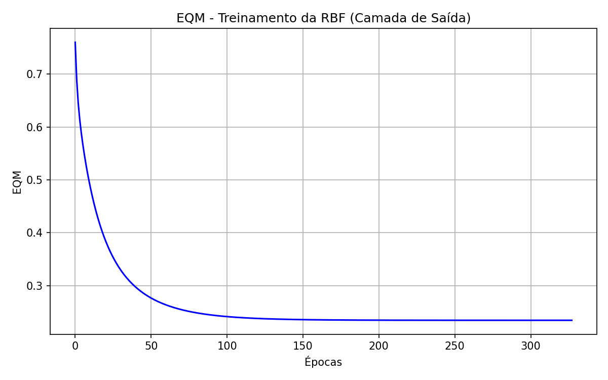

# Centro Federal de Educação Tecnológica de Minas Gerais
**Campus VIII – Varginha**  
**Bacharelado em Sistemas de Informação**  
**Disciplina:** Lab. Inteligência Artificial  
**Professor:** Lázaro Eduardo da Silva  
**Data:** 20/05/2026  
**Aluno(a):** Álvaro Henrique Duarte Mendes  
**Valor:** 100% | **Nota:** _______

---

## Atividade 06 - RBF

A verificação da presença de radiação em determinados compostos nucleares é feita através da análise da concentração de duas variáveis ($x_1$ e $x_2$). A partir de 50 situações (40 para treinamento e 10 para teste), treinou-se uma rede neural RBF (Função de Base Radial) para classificação de padrões. A topologia utilizada possui 2 entradas, 2 neurônios na camada oculta e 1 saída.

### 1. Treinamento da Camada Escondida (k-means)

O treinamento da camada escondida (centros e variâncias dos clusters) foi realizado considerando apenas os padrões com presença de radiação (d = 1), utilizando o algoritmo k-means.

| Cluster | Centro ($x_1$, $x_2$) | Variância ($\sigma^2$) |
|:---:|:---:|:---:|
| **1** | (0.1648, 0.6121) | 0.0298 |
| **2** | (0.3990, 0.1571) | 0.0385 |

### 2. Treinamento da Camada de Saída (Regra Delta)

A camada de saída foi treinada com a regra delta generalizada (LMS) com taxa de aprendizado $\eta = 0.01$ e precisão $\epsilon = 10^{-7}$.

| Peso | Valor |
|:---:|:---:|
| **W21,0 (Bias)** | 1.002648 |
| **W21,1** | 2.378023 |
| **W21,2** | 2.697699 |

* A rede convergiu em 327 épocas (EQM final: 0.234239, Tempo: 0.0250s).

### 3. Validação da Rede (Conjunto de Teste)

O pós-processamento foi feito através da função sinal: $y_{pós} = \text{sgn}(y)$.

| Amostra | $x_1$ | $x_2$ | $d$ | $y$ (Real) | $y_{pós}$ |
|:---:|:---:|:---:|:---:|:---:|:---:|
| **1** | 0.8705 | 0.9329 | -1 | -1.0025 | -1 |
| **2** | 0.0388 | 0.2703 | 1 | -0.3231 | -1 |
| **3** | 0.8236 | 0.4458 | -1 | -0.9140 | -1 |
| **4** | 0.7075 | 0.1502 | 1 | -0.2201 | -1 |
| **5** | 0.9587 | 0.8663 | -1 | -1.0026 | -1 |
| **6** | 0.6115 | 0.9365 | -1 | -0.9878 | -1 |
| **7** | 0.3534 | 0.3646 | 1 | 0.9665 | 1 |
| **8** | 0.3268 | 0.2766 | 1 | 1.3232 | 1 |
| **9** | 0.6129 | 0.4518 | -1 | -0.4682 | -1 |
| **10** | 0.9948 | 0.4962 | -1 | -0.9966 | -1 |

**Taxa de Acerto:** 80.00%

### 4. Gráfico do Erro Quadrático Médio (EQM)

### 5. Estratégias para Aumentar a Taxa de Acerto

Caso a rede não atinja uma acurácia desejada, as seguintes abordagens poderiam ser adotadas:
1. **Aumentar o Número de Clusters (Neurônios Ocultos):** Isso daria maior capacidade de representação das regiões de ativação para a classe de presença de radiação.
2. **K-Means com Todas as Classes:** Modificar o treinamento da camada oculta para que os centros representem melhor todo o espaço, e não apenas a classe de presença de radiação (embora o enunciado exija apenas a presença).
3. **Variâncias Individuais por Eixo:** Ao invés de uma única variância (isotrópica) para cada cluster, usar uma matriz de covariância para capturar relações direcionais dos dados.
4. **Tuning da Taxa de Aprendizado ($\eta$):** Ajustar o valor ou aplicar um decaimento, o que pode levar a um ajuste mais fino dos pesos.
