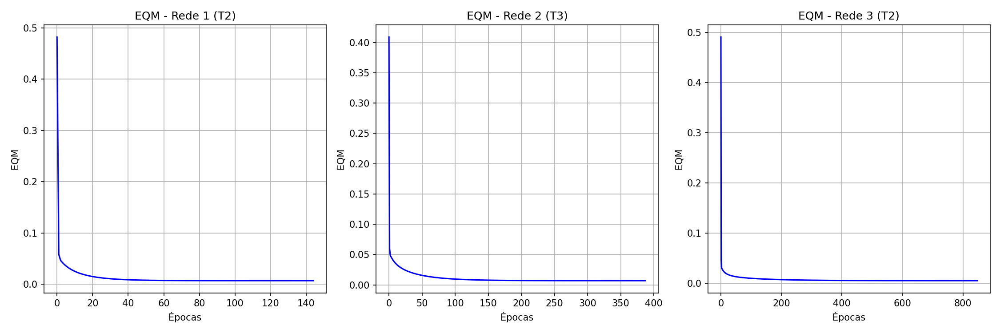

# Centro Federal de Educação Tecnológica de Minas Gerais
**Campus VIII – Varginha**  
**Bacharelado em Sistemas de Informação**  
**Disciplina:** Lab. Inteligência Artificial  
**Professor:** Lázaro Eduardo da Silva  
**Data:** 20/05/2026  
**Aluno(a):** Álvaro Henrique Duarte Mendes  
**Valor:** 100% | **Nota:** _______

---

## Atividade 07 - RBF

Mapeamento de um sistema de injeção eletrônica utilizando redes neurais RBF (aproximação funcional). O objetivo é computar a quantidade de gasolina ($y$) a ser injetada em função de três variáveis ($x_1, x_2, x_3$). Foram testadas três topologias com diferentes quantidades de neurônios ocultos ($N_1 = 5, 10, 15$).

### 1. Treinamentos Realizados

Foram realizados 3 treinamentos para cada topologia, inicializando os pesos aleatoriamente entre 0 e 1, taxa de aprendizado $\eta = 0.01$ e precisão $\epsilon = 10^{-7}$.

| Treinamento | Rede 1 ($N_1=5$) | | Rede 2 ($N_1=10$) | | Rede 3 ($N_1=15$) | |
|:---:|:---:|:---:|:---:|:---:|:---:|:---:|
| | **EQM** | **Épocas** | **EQM** | **Épocas** | **EQM** | **Épocas** |
| **1º (T1)** | 0.009256 | 116 | 0.006431 | 404 | 0.005224 | 699 |
| **2º (T2)** | 0.007163 | 144 | 0.003720 | 536 | 0.005076 | 847 |
| **3º (T3)** | 0.009679 | 150 | 0.006954 | 387 | 0.004136 | 761 |

### 2. Validação da Rede (Conjunto de Teste)

Para a validação, foram comparados os valores de saída previstos pela rede ($y$) contra os valores desejados ($d$). O Erro Relativo Médio (%) e a Variância (%) foram calculados para cada rede.

| Amostra | $x_1$ | $x_2$ | $x_3$ | $d$ | Rede 1 (T1) | (T2) | (T3) | Rede 2 (T1) | (T2) | (T3) | Rede 3 (T1) | (T2) | (T3) |
|:---:|:---:|:---:|:---:|:---:|:---:|:---:|:---:|:---:|:---:|:---:|:---:|:---:|:---:|
| **01** | 0.5102 | 0.7464 | 0.0860 | 0.5965 | 0.5495 | 0.6054 | 0.6289 | 0.5823 | 0.6432 | 0.5892 | 0.6027 | 0.5782 | 0.5977 |
| **02** | 0.8401 | 0.4490 | 0.2719 | 0.6790 | 0.6442 | 0.6662 | 0.7721 | 0.6673 | 0.6341 | 0.6684 | 0.6383 | 0.6566 | 0.6447 |
| **03** | 0.1283 | 0.1882 | 0.7253 | 0.4662 | 0.4110 | 0.4262 | 0.4546 | 0.5027 | 0.5032 | 0.4986 | 0.4212 | 0.5131 | 0.5244 |
| **04** | 0.2299 | 0.1524 | 0.7353 | 0.5012 | 0.4123 | 0.4478 | 0.4485 | 0.5175 | 0.5136 | 0.5259 | 0.4647 | 0.5156 | 0.5592 |
| **05** | 0.3209 | 0.6229 | 0.5233 | 0.6810 | 0.6499 | 0.6358 | 0.6954 | 0.7032 | 0.6736 | 0.6721 | 0.6904 | 0.6084 | 0.6708 |
| **06** | 0.8203 | 0.0682 | 0.4260 | 0.5643 | 0.5925 | 0.4942 | 0.5993 | 0.5521 | 0.5786 | 0.5542 | 0.5624 | 0.5651 | 0.5934 |
| **07** | 0.3471 | 0.8889 | 0.1564 | 0.5875 | 0.5748 | 0.5711 | 0.5552 | 0.5768 | 0.5984 | 0.5863 | 0.5820 | 0.5703 | 0.6126 |
| **08** | 0.5762 | 0.8292 | 0.4116 | 0.7853 | 0.8009 | 0.7780 | 0.8369 | 0.8117 | 0.7553 | 0.7999 | 0.7990 | 0.7457 | 0.7210 |
| **09** | 0.9053 | 0.6245 | 0.5264 | 0.8506 | 0.9291 | 0.9072 | 0.8910 | 0.9163 | 0.8605 | 0.9143 | 0.9197 | 0.8242 | 0.8750 |
| **10** | 0.8149 | 0.0396 | 0.6227 | 0.6165 | 0.5984 | 0.5934 | 0.5866 | 0.5764 | 0.7230 | 0.5771 | 0.5915 | 0.7146 | 0.7339 |
| **11** | 0.1016 | 0.6382 | 0.3173 | 0.4957 | 0.5542 | 0.5113 | 0.4627 | 0.5177 | 0.5424 | 0.5052 | 0.5125 | 0.5126 | 0.4796 |
| **12** | 0.9108 | 0.2139 | 0.4641 | 0.6625 | 0.6466 | 0.6151 | 0.6676 | 0.5990 | 0.6172 | 0.6006 | 0.5911 | 0.6408 | 0.6502 |
| **13** | 0.2245 | 0.0971 | 0.6136 | 0.4402 | 0.3804 | 0.4072 | 0.3840 | 0.4268 | 0.4676 | 0.4286 | 0.4281 | 0.4525 | 0.4727 |
| **14** | 0.6423 | 0.3229 | 0.8567 | 0.7663 | 0.6751 | 0.8699 | 0.6515 | 0.7479 | 0.7460 | 0.7441 | 0.7212 | 0.7443 | 0.6990 |
| **15** | 0.5252 | 0.6529 | 0.5729 | 0.7893 | 0.8757 | 0.8420 | 0.8587 | 0.8897 | 0.7923 | 0.8912 | 0.8444 | 0.7842 | 0.7365 |
| **Erro Rel. Med. (%)** | | | | | **  7.94** | **  6.25** | **  7.07** | **  4.81** | **  5.21** | **  4.23** | **  4.69** | **  4.67** | **  6.55** |
| **Variância (%)** | | | | | ** 22.45** | ** 14.43** | ** 17.08** | ** 10.22** | ** 18.31** | ** 12.45** | ** 10.71** | ** 16.76** | ** 23.10** |

### 3. Gráficos do Erro Quadrático Médio (EQM)

Gráficos para o melhor treinamento (menor erro no teste) de cada topologia:
- **Rede 1**: T2
- **Rede 2**: T3
- **Rede 3**: T2

### 4. Conclusão sobre as Topologias

Baseado nas análises, a topologia mais adequada para este problema é a **Rede 2**, em sua configuração final de treinamento **T3**. Essa configuração apresentou o menor Erro Relativo Médio (4.23%) no conjunto de teste, indicando a melhor generalização para a aproximação funcional exigida, além de manter uma variância baixa, o que denota estabilidade nas predições do sistema de injeção eletrônica.
