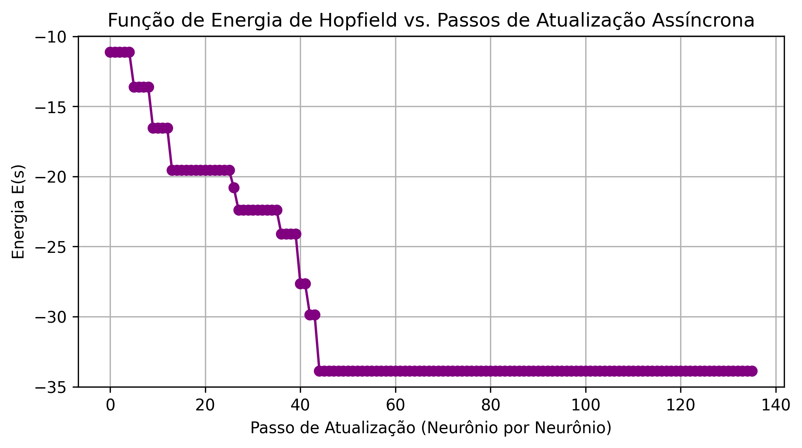
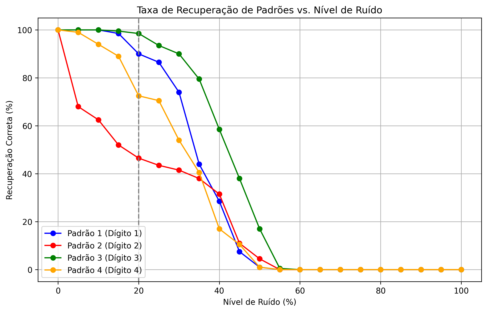

# Centro Federal de Educação Tecnológica de Minas Gerais
**Campus VIII – Varginha**  
**Bacharelado em Sistemas de Informação**  
**Disciplina:** Lab. Inteligência Artificial  
**Professor:** Lázaro Eduardo da Silva  
**Data:** 28/05/2026  
**Aluno(a):** Álvaro Henrique Duarte Mendes  
**Valor:** 100% | **Nota:** _______

---

## Atividade 08 - Hopfield

Implementação de uma memória associativa utilizando uma rede de Hopfield com 45 neurônios para armazenar e recuperar quatro padrões digitais de 45 bits (dígitos 1, 2, 3 e 4). As imagens originais foram codificadas utilizando $+1$ para pixels escuros (representados por `#`) e $-1$ para pixels brancos (representados por `.`).

Abaixo são descritos os testes realizados com 20% de ruído (9 pixels corrompidos aleatoriamente) em 12 situações de transmissão (3 para cada dígito).

### 1. Padrões Originais Armazenados (Memórias)

Os quatro padrões de dígitos armazenados na memória associativa da rede são apresentados na tabela a seguir:

| C0 | C1 | C2 | C3 | C4 | C5 | C6 | C7 | C8 | C9 | C10 | C11 | C12 | C13 | C14 | C15 | C16 | C17 | C18 | C19 | C20 | C21 | C22 |
|:---:|:---:|:---:|:---:|:---:|:---:|:---:|:---:|:---:|:---:|:---:|:---:|:---:|:---:|:---:|:---:|:---:|:---:|:---:|:---:|:---:|:---:|:---:|
| . | . | . | # | # | . | . | # | # | # | # | # | . | # | # | # | # | # | . | # | # | . | # | # |
| . | . | # | # | # | . | . | # | # | # | # | # | . | # | # | # | # | # | . | # | # | . | # | # |
| . | . | . | # | # | . | . | . | . | . | # | # | . | . | . | . | # | # | . | # | # | . | # | # |
| . | . | . | # | # | . | . | . | . | . | # | # | . | . | . | . | # | # | . | # | # | # | # | # |
| . | . | . | # | # | . | . | # | # | # | # | # | . | # | # | # | # | # | . | # | # | # | # | # |
| . | . | . | # | # | . | . | # | # | . | . | . | . | . | . | . | # | # | . | . | . | . | # | # |
| . | . | . | # | # | . | . | # | # | . | . | . | . | . | . | . | # | # | . | . | . | . | # | # |
| . | . | . | # | # | . | . | # | # | # | # | # | . | # | # | # | # | # | . | . | . | . | # | # |
| . | . | . | # | # | . | . | # | # | # | # | # | . | # | # | # | # | # | . | . | . | . | # | # |

*Legenda: As memórias dos dígitos 1, 2, 3 e 4 estão separadas por colunas espaçadoras (`.`)*

### 2. Simulações de Transmissão (12 Casos)
Para cada um dos 4 padrões de dígitos, foram geradas 3 transmissões ruidosas simuladas adicionando-se 20% de ruído (9 flips aleatórios de bit). A recuperação das imagens limpas foi realizada utilizando atualização assíncrona dos neurônios.

#### Padrão 1 (Dígito 1)

* **Situação 1**: Recuperação bem-sucedida: **True**

| C0 | C1 | C2 | C3 | C4 | C5 | C6 | C7 | C8 | C9 | C10 | C11 | C12 | C13 | C14 | C15 | C16 | C17 | C18 |
|:---:|:---:|:---:|:---:|:---:|:---:|:---:|:---:|:---:|:---:|:---:|:---:|:---:|:---:|:---:|:---:|:---:|:---:|:---:|
| . | . | . | # | # | . | . | . | . | # | # | . | . | . | . | # | # | . | . |
| . | . | # | # | # | . | . | # | # | # | . | . | . | . | # | # | # | . | . |
| . | . | . | # | # | . | . | # | # | # | . | . | . | . | . | # | # | . | . |
| . | . | . | # | # | . | . | . | . | # | . | . | . | . | . | # | # | . | . |
| . | . | . | # | # | . | . | . | . | # | # | # | . | . | . | # | # | . | . |
| . | . | . | # | # | . | . | . | . | . | # | . | . | . | . | # | # | . | . |
| . | . | . | # | # | . | . | # | . | # | # | . | . | . | . | # | # | . | . |
| . | . | . | # | # | . | . | . | . | # | # | . | . | . | . | # | # | . | . |
| . | . | . | # | # | . | . | . | . | # | # | . | . | . | . | # | # | . | . |

*Colunas 1 a 5: Imagem Transmitida | Colunas 7 a 11: Imagem Distorcida | Colunas 13 a 17: Imagem Limpa Recuperada.*

* **Situação 2**: Recuperação bem-sucedida: **True**

| C0 | C1 | C2 | C3 | C4 | C5 | C6 | C7 | C8 | C9 | C10 | C11 | C12 | C13 | C14 | C15 | C16 | C17 | C18 |
|:---:|:---:|:---:|:---:|:---:|:---:|:---:|:---:|:---:|:---:|:---:|:---:|:---:|:---:|:---:|:---:|:---:|:---:|:---:|
| . | . | . | # | # | . | . | # | . | . | # | # | . | . | . | # | # | . | . |
| . | . | # | # | # | . | . | # | # | # | # | . | . | . | # | # | # | . | . |
| . | . | . | # | # | . | . | . | . | # | # | . | . | . | . | # | # | . | . |
| . | . | . | # | # | . | . | . | . | # | . | . | . | . | . | # | # | . | . |
| . | . | . | # | # | . | . | . | # | # | # | . | . | . | . | # | # | . | . |
| . | . | . | # | # | . | . | . | . | . | # | . | . | . | . | # | # | . | . |
| . | . | . | # | # | . | . | # | . | # | # | . | . | . | . | # | # | . | . |
| . | . | . | # | # | . | . | # | . | # | # | . | . | . | . | # | # | . | . |
| . | . | . | # | # | . | . | . | . | # | # | . | . | . | . | # | # | . | . |

*Colunas 1 a 5: Imagem Transmitida | Colunas 7 a 11: Imagem Distorcida | Colunas 13 a 17: Imagem Limpa Recuperada.*

* **Situação 3**: Recuperação bem-sucedida: **True**

| C0 | C1 | C2 | C3 | C4 | C5 | C6 | C7 | C8 | C9 | C10 | C11 | C12 | C13 | C14 | C15 | C16 | C17 | C18 |
|:---:|:---:|:---:|:---:|:---:|:---:|:---:|:---:|:---:|:---:|:---:|:---:|:---:|:---:|:---:|:---:|:---:|:---:|:---:|
| . | . | . | # | # | . | . | . | . | . | # | . | . | . | . | # | # | . | . |
| . | . | # | # | # | . | . | . | . | # | . | . | . | . | # | # | # | . | . |
| . | . | . | # | # | . | . | . | # | . | # | . | . | . | . | # | # | . | . |
| . | . | . | # | # | . | . | . | . | # | # | . | . | . | . | # | # | . | . |
| . | . | . | # | # | . | . | . | . | # | # | . | . | . | . | # | # | . | . |
| . | . | . | # | # | . | . | . | . | . | . | . | . | . | . | # | # | . | . |
| . | . | . | # | # | . | . | . | . | # | # | . | . | . | . | # | # | . | . |
| . | . | . | # | # | . | . | . | . | # | # | . | . | . | . | # | # | . | . |
| . | . | . | # | # | . | . | # | . | . | # | . | . | . | . | # | # | . | . |

*Colunas 1 a 5: Imagem Transmitida | Colunas 7 a 11: Imagem Distorcida | Colunas 13 a 17: Imagem Limpa Recuperada.*

#### Padrão 2 (Dígito 2)

* **Situação 1**: Recuperação bem-sucedida: **True**

| C0 | C1 | C2 | C3 | C4 | C5 | C6 | C7 | C8 | C9 | C10 | C11 | C12 | C13 | C14 | C15 | C16 | C17 | C18 |
|:---:|:---:|:---:|:---:|:---:|:---:|:---:|:---:|:---:|:---:|:---:|:---:|:---:|:---:|:---:|:---:|:---:|:---:|:---:|
| . | # | # | # | # | # | . | . | # | # | # | # | . | # | # | # | # | # | . |
| . | # | # | # | # | # | . | # | . | # | # | # | . | # | # | # | # | # | . |
| . | . | . | . | # | # | . | . | # | . | . | # | . | . | . | . | # | # | . |
| . | . | . | . | # | # | . | # | . | . | # | # | . | . | . | . | # | # | . |
| . | # | # | # | # | # | . | # | # | # | # | . | . | # | # | # | # | # | . |
| . | # | # | . | . | . | . | # | # | # | . | . | . | # | # | . | . | . | . |
| . | # | # | . | . | . | . | # | # | . | . | . | . | # | # | . | . | . | . |
| . | # | # | # | # | # | . | # | . | # | # | . | . | # | # | # | # | # | . |
| . | # | # | # | # | # | . | # | # | # | # | # | . | # | # | # | # | # | . |

*Colunas 1 a 5: Imagem Transmitida | Colunas 7 a 11: Imagem Distorcida | Colunas 13 a 17: Imagem Limpa Recuperada.*

* **Situação 2**: Recuperação bem-sucedida: **True**

| C0 | C1 | C2 | C3 | C4 | C5 | C6 | C7 | C8 | C9 | C10 | C11 | C12 | C13 | C14 | C15 | C16 | C17 | C18 |
|:---:|:---:|:---:|:---:|:---:|:---:|:---:|:---:|:---:|:---:|:---:|:---:|:---:|:---:|:---:|:---:|:---:|:---:|:---:|
| . | # | # | # | # | # | . | # | . | # | # | # | . | # | # | # | # | # | . |
| . | # | # | # | # | # | . | # | # | # | # | # | . | # | # | # | # | # | . |
| . | . | . | . | # | # | . | # | # | # | # | # | . | . | . | . | # | # | . |
| . | . | . | . | # | # | . | # | . | . | # | . | . | . | . | . | # | # | . |
| . | # | # | # | # | # | . | # | . | # | # | . | . | # | # | # | # | # | . |
| . | # | # | . | . | . | . | # | # | . | . | . | . | # | # | . | . | . | . |
| . | # | # | . | . | . | . | # | # | . | . | . | . | # | # | . | . | . | . |
| . | # | # | # | # | # | . | # | # | # | # | # | . | # | # | # | # | # | . |
| . | # | # | # | # | # | . | # | # | . | # | # | . | # | # | # | # | # | . |

*Colunas 1 a 5: Imagem Transmitida | Colunas 7 a 11: Imagem Distorcida | Colunas 13 a 17: Imagem Limpa Recuperada.*

* **Situação 3**: Recuperação bem-sucedida: **False**

| C0 | C1 | C2 | C3 | C4 | C5 | C6 | C7 | C8 | C9 | C10 | C11 | C12 | C13 | C14 | C15 | C16 | C17 | C18 |
|:---:|:---:|:---:|:---:|:---:|:---:|:---:|:---:|:---:|:---:|:---:|:---:|:---:|:---:|:---:|:---:|:---:|:---:|:---:|
| . | # | # | # | # | # | . | # | # | # | # | . | . | # | # | # | # | # | . |
| . | # | # | # | # | # | . | # | . | # | # | # | . | # | # | # | # | # | . |
| . | . | . | . | # | # | . | # | . | # | # | # | . | . | . | . | # | # | . |
| . | . | . | . | # | # | . | . | . | . | # | # | . | . | . | . | # | # | . |
| . | # | # | # | # | # | . | # | # | # | # | . | . | # | # | # | # | # | . |
| . | # | # | . | . | . | . | # | . | . | . | . | . | . | . | . | # | # | . |
| . | # | # | . | . | . | . | # | . | . | . | . | . | . | . | . | # | # | . |
| . | # | # | # | # | # | . | # | . | # | # | # | . | # | # | # | # | # | . |
| . | # | # | # | # | # | . | # | # | # | # | . | . | # | # | # | # | # | . |

*Colunas 1 a 5: Imagem Transmitida | Colunas 7 a 11: Imagem Distorcida | Colunas 13 a 17: Imagem Limpa Recuperada.*

#### Padrão 3 (Dígito 3)

* **Situação 1**: Recuperação bem-sucedida: **True**

| C0 | C1 | C2 | C3 | C4 | C5 | C6 | C7 | C8 | C9 | C10 | C11 | C12 | C13 | C14 | C15 | C16 | C17 | C18 |
|:---:|:---:|:---:|:---:|:---:|:---:|:---:|:---:|:---:|:---:|:---:|:---:|:---:|:---:|:---:|:---:|:---:|:---:|:---:|
| . | # | # | # | # | # | . | # | . | # | # | # | . | # | # | # | # | # | . |
| . | # | # | # | # | # | . | . | # | # | . | . | . | # | # | # | # | # | . |
| . | . | . | . | # | # | . | . | . | . | # | . | . | . | . | . | # | # | . |
| . | . | . | . | # | # | . | . | . | . | # | # | . | . | . | . | # | # | . |
| . | # | # | # | # | # | . | # | # | # | # | . | . | # | # | # | # | # | . |
| . | . | . | . | # | # | . | . | . | . | # | # | . | . | . | . | # | # | . |
| . | . | . | . | # | # | . | . | . | # | # | # | . | . | . | . | # | # | . |
| . | # | # | # | # | # | . | . | # | # | # | # | . | # | # | # | # | # | . |
| . | # | # | # | # | # | . | # | # | # | # | . | . | # | # | # | # | # | . |

*Colunas 1 a 5: Imagem Transmitida | Colunas 7 a 11: Imagem Distorcida | Colunas 13 a 17: Imagem Limpa Recuperada.*

* **Situação 2**: Recuperação bem-sucedida: **True**

| C0 | C1 | C2 | C3 | C4 | C5 | C6 | C7 | C8 | C9 | C10 | C11 | C12 | C13 | C14 | C15 | C16 | C17 | C18 |
|:---:|:---:|:---:|:---:|:---:|:---:|:---:|:---:|:---:|:---:|:---:|:---:|:---:|:---:|:---:|:---:|:---:|:---:|:---:|
| . | # | # | # | # | # | . | # | # | # | # | # | . | # | # | # | # | # | . |
| . | # | # | # | # | # | . | # | # | . | # | # | . | # | # | # | # | # | . |
| . | . | . | . | # | # | . | . | . | . | # | # | . | . | . | . | # | # | . |
| . | . | . | . | # | # | . | . | . | . | # | # | . | . | . | . | # | # | . |
| . | # | # | # | # | # | . | # | . | # | # | # | . | # | # | # | # | # | . |
| . | . | . | . | # | # | . | . | # | . | # | # | . | . | . | . | # | # | . |
| . | . | . | . | # | # | . | . | . | # | . | # | . | . | . | . | # | # | . |
| . | # | # | # | # | # | . | # | . | # | # | # | . | # | # | # | # | # | . |
| . | # | # | # | # | # | . | . | . | . | # | # | . | # | # | # | # | # | . |

*Colunas 1 a 5: Imagem Transmitida | Colunas 7 a 11: Imagem Distorcida | Colunas 13 a 17: Imagem Limpa Recuperada.*

* **Situação 3**: Recuperação bem-sucedida: **True**

| C0 | C1 | C2 | C3 | C4 | C5 | C6 | C7 | C8 | C9 | C10 | C11 | C12 | C13 | C14 | C15 | C16 | C17 | C18 |
|:---:|:---:|:---:|:---:|:---:|:---:|:---:|:---:|:---:|:---:|:---:|:---:|:---:|:---:|:---:|:---:|:---:|:---:|:---:|
| . | # | # | # | # | # | . | . | # | # | # | # | . | # | # | # | # | # | . |
| . | # | # | # | # | # | . | # | # | # | # | . | . | # | # | # | # | # | . |
| . | . | . | . | # | # | . | . | . | . | # | # | . | . | . | . | # | # | . |
| . | . | . | . | # | # | . | . | . | . | # | # | . | . | . | . | # | # | . |
| . | # | # | # | # | # | . | # | # | # | # | # | . | # | # | # | # | # | . |
| . | . | . | . | # | # | . | # | . | . | . | # | . | . | . | . | # | # | . |
| . | . | . | . | # | # | . | # | . | # | . | # | . | . | . | . | # | # | . |
| . | # | # | # | # | # | . | . | # | # | # | # | . | # | # | # | # | # | . |
| . | # | # | # | # | # | . | . | # | # | # | # | . | # | # | # | # | # | . |

*Colunas 1 a 5: Imagem Transmitida | Colunas 7 a 11: Imagem Distorcida | Colunas 13 a 17: Imagem Limpa Recuperada.*

#### Padrão 4 (Dígito 4)

* **Situação 1**: Recuperação bem-sucedida: **True**

| C0 | C1 | C2 | C3 | C4 | C5 | C6 | C7 | C8 | C9 | C10 | C11 | C12 | C13 | C14 | C15 | C16 | C17 | C18 |
|:---:|:---:|:---:|:---:|:---:|:---:|:---:|:---:|:---:|:---:|:---:|:---:|:---:|:---:|:---:|:---:|:---:|:---:|:---:|
| . | # | # | . | # | # | . | # | . | . | . | # | . | # | # | . | # | # | . |
| . | # | # | . | # | # | . | # | # | . | # | # | . | # | # | . | # | # | . |
| . | # | # | . | # | # | . | # | # | # | # | # | . | # | # | . | # | # | . |
| . | # | # | # | # | # | . | # | # | # | # | # | . | # | # | # | # | # | . |
| . | # | # | # | # | # | . | # | # | # | # | # | . | # | # | # | # | # | . |
| . | . | . | . | # | # | . | . | # | . | # | # | . | . | . | . | # | # | . |
| . | . | . | . | # | # | . | . | # | # | # | # | . | . | . | . | # | # | . |
| . | . | . | . | # | # | . | # | . | . | . | # | . | . | . | . | # | # | . |
| . | . | . | . | # | # | . | # | . | . | # | # | . | . | . | . | # | # | . |

*Colunas 1 a 5: Imagem Transmitida | Colunas 7 a 11: Imagem Distorcida | Colunas 13 a 17: Imagem Limpa Recuperada.*

* **Situação 2**: Recuperação bem-sucedida: **True**

| C0 | C1 | C2 | C3 | C4 | C5 | C6 | C7 | C8 | C9 | C10 | C11 | C12 | C13 | C14 | C15 | C16 | C17 | C18 |
|:---:|:---:|:---:|:---:|:---:|:---:|:---:|:---:|:---:|:---:|:---:|:---:|:---:|:---:|:---:|:---:|:---:|:---:|:---:|
| . | # | # | . | # | # | . | # | # | . | # | # | . | # | # | . | # | # | . |
| . | # | # | . | # | # | . | # | . | . | # | . | . | # | # | . | # | # | . |
| . | # | # | . | # | # | . | # | # | . | # | . | . | # | # | . | # | # | . |
| . | # | # | # | # | # | . | # | # | . | # | # | . | # | # | # | # | # | . |
| . | # | # | # | # | # | . | # | . | # | # | # | . | # | # | # | # | # | . |
| . | . | . | . | # | # | . | . | # | . | # | # | . | . | . | . | # | # | . |
| . | . | . | . | # | # | . | . | # | . | # | # | . | . | . | . | # | # | . |
| . | . | . | . | # | # | . | . | . | . | . | . | . | . | . | . | # | # | . |
| . | . | . | . | # | # | . | . | . | . | # | # | . | . | . | . | # | # | . |

*Colunas 1 a 5: Imagem Transmitida | Colunas 7 a 11: Imagem Distorcida | Colunas 13 a 17: Imagem Limpa Recuperada.*

* **Situação 3**: Recuperação bem-sucedida: **True**

| C0 | C1 | C2 | C3 | C4 | C5 | C6 | C7 | C8 | C9 | C10 | C11 | C12 | C13 | C14 | C15 | C16 | C17 | C18 |
|:---:|:---:|:---:|:---:|:---:|:---:|:---:|:---:|:---:|:---:|:---:|:---:|:---:|:---:|:---:|:---:|:---:|:---:|:---:|
| . | # | # | . | # | # | . | # | # | . | # | # | . | # | # | . | # | # | . |
| . | # | # | . | # | # | . | # | # | . | # | . | . | # | # | . | # | # | . |
| . | # | # | . | # | # | . | . | # | . | # | # | . | # | # | . | # | # | . |
| . | # | # | # | # | # | . | # | # | # | # | # | . | # | # | # | # | # | . |
| . | # | # | # | # | # | . | . | # | . | # | # | . | # | # | # | # | # | . |
| . | . | . | . | # | # | . | . | . | . | . | # | . | . | . | . | # | # | . |
| . | . | . | . | # | # | . | . | . | . | # | . | . | . | . | . | # | # | . |
| . | . | . | . | # | # | . | . | . | . | . | # | . | . | . | . | # | # | . |
| . | . | . | . | # | # | . | . | . | . | . | . | . | . | . | . | # | # | . |

*Colunas 1 a 5: Imagem Transmitida | Colunas 7 a 11: Imagem Distorcida | Colunas 13 a 17: Imagem Limpa Recuperada.*

### 3. Análise de Convergência de Energia
A rede de Hopfield opera minimizando uma função de energia global definida por $E = -\frac{1}{2} S^T W S$. A cada atualização assíncrona de um neurônio, a energia da rede é garantida de decrescer ou permanecer constante até atingir um mínimo local (estado estável correspondente a uma memória armazenada ou a um estado espúrio).

O gráfico abaixo ilustra a convergência da função de energia para uma simulação com ruído:

### 4. Análise de Ruído Excessivo
O gráfico a seguir apresenta a taxa de recuperação exata da rede para cada um dos 4 padrões de dígitos em função do nível de ruído na transmissão (variando de 0% a 100% de bits corrompidos):

#### Discussão sobre o Aumento de Ruído:
Quando aumentamos excessivamente o nível de ruído (acima de 25% a 30%), a capacidade de recuperação exata da rede decai de forma acentuada devido a três fatores principais:

1. **Basins of Attraction (Bacias de Atração) e Similaridade**: Os padrões 2 e 3 são extremamente semelhantes no formato visual, diferindo por apenas 8 bits nos 45 totais (distância de Hamming muito pequena). Quando aplicamos 20% de ruído (9 bits alterados), o padrão 2 frequentemente cai dentro da bacia de atração do padrão 3. Isso explica o motivo pelo qual a taxa de sucesso do dígito 2 é inferior à do dígito 3 nas simulações.
2. **Estados Espúrios (Spurious States)**: A rede pode convergir para mínimos locais de energia que não correspondem a nenhuma das memórias originais de treinamento. Esses estados são combinações lineares locais e estáveis formadas pela interferência mútua entre as memórias armazenadas.
3. **Simetria dos Padrões Negativos**: Como a função de energia da rede é simétrica em relação à inversão de todos os bits ($E(S) = E(-S)$), o inverso de cada um dos padrões armazenados (sua versão em 'negativo') também é um mínimo estável de energia. Sob altos níveis de ruído (>50%), a rede frequentemente recupera o inverso exato da imagem transmitida.

### 5. Conclusão
A rede de Hopfield com 45 neurônios provou ser altamente eficaz como memória associativa para armazenar e recuperar os quatro padrões definidos sob níveis normais de ruído (como 10% a 20%). A atualização assíncrona garante a convergência para um estado de energia mínima. No entanto, a proximidade estrutural entre os dígitos 2 e 3 impõe um limite físico à fidelidade de recuperação do dígito 2 sob condições de ruído mais elevado, evidenciando que a capacidade e estabilidade de uma rede de Hopfield dependem intimamente da ortogonalidade (distância de Hamming) entre os padrões armazenados.