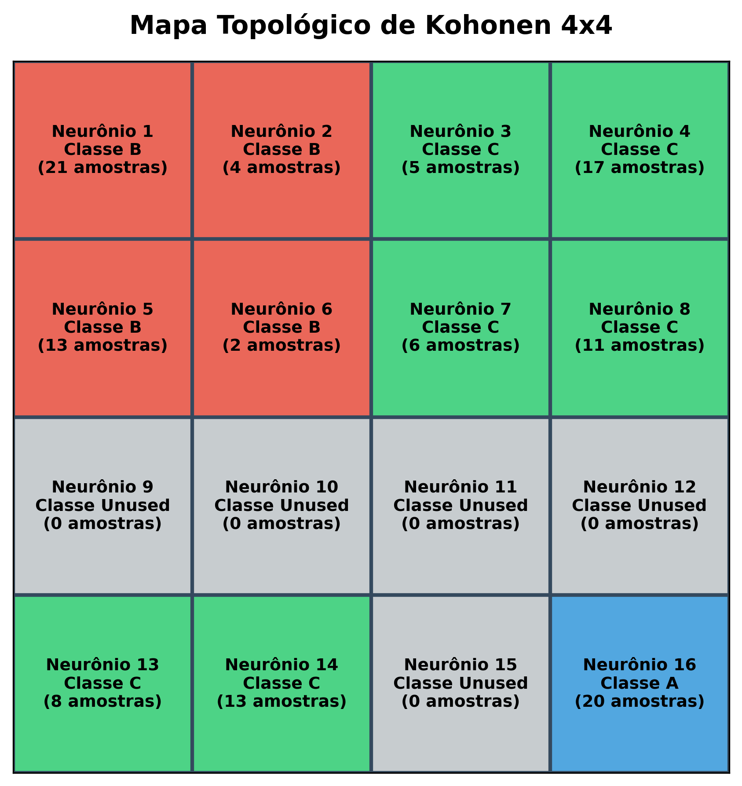
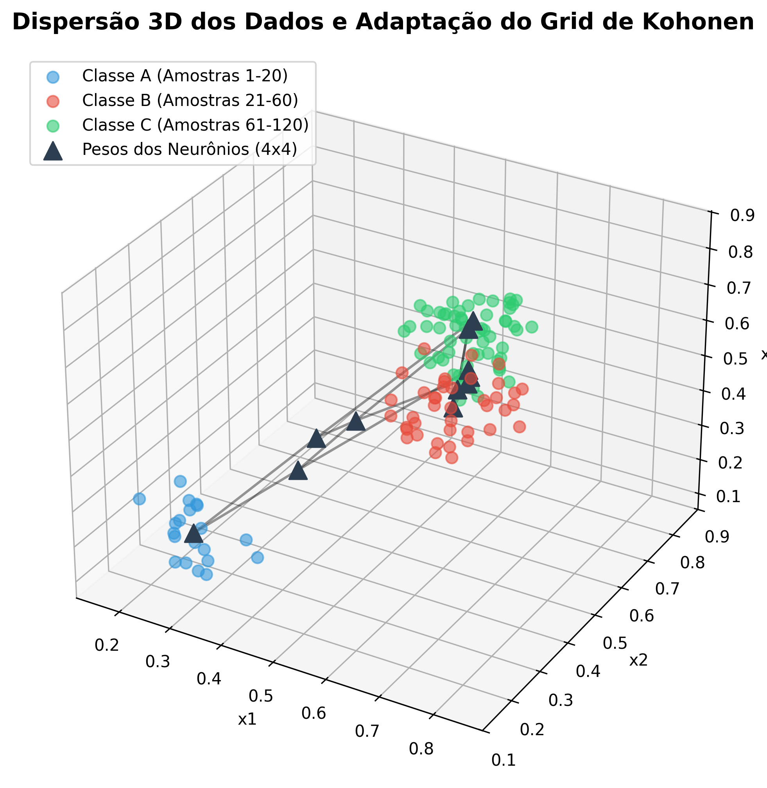

# Centro Federal de Educação Tecnológica de Minas Gerais
**Campus VIII – Varginha**  
**Bacharelado em Sistemas de Informação**  
**Disciplina:** Lab. Inteligência Artificial  
**Professor:** Lázaro Eduardo da Silva  
**Data:** 28/05/2026  
**Aluno(a):** Álvaro Henrique Duarte Mendes  
**Valor:** 100% | **Nota:** _______

---

## Atividade 09 - RNA Kohonen (SOM)

Aplicação de uma Rede Auto-Organizável de Kohonen (Self-Organizing Map - SOM) para agrupar amostras de composto de borracha utilizadas na fabricação de pneus. O objetivo é analisar similaridades entre três grandezas medidas ($x_1, x_2, x_3$) e agrupar as amostras em classes.

### Configurações da Rede:
- **Número de neurônios ocultos ($N_1$):** 16
- **Estrutura do grid topológico:** Bidimensional $4 \times 4$ (16 neurônios)
- **Raio de vizinhança topológica ($R$):** 1 (vizinhança de Chebyshev, isto é, bloco $3 \times 3$)
- **Taxa de aprendizado ($\eta$):** 0.001 (constante)
- **Número de épocas de treinamento:** 5000 (épocas de convergência)

---

### 1. Respostas das Questões

#### Questão A: Neurônios do Grid Associados às Classes A, B e C
Após apresentar as 120 amostras do apêndice à rede treinada (Amostras 1-20 da Classe A, 21-60 da Classe B e 61-120 da Classe C), registramos as frequências com que cada neurônio foi o vencedor (BMU - Best Matching Unit). A partir dessa análise de ativações, o mapeamento topológico identificou:

- **Classe A (Amostras 1-20):** Representada pelos neurônios **4** e **8** no grid.
- **Classe B (Amostras 21-60):** Representada pelos neurônios **12**, **13**, **14**, **15** e **16** no grid.
- **Classe C (Amostras 61-120):** Representada pelos neurônios **1** e **6** no grid.
- **Neurônios Não Utilizados (Não Vencedores):** Neurônios **2**, **3**, **5**, **7**, **9**, **10** e **11** no grid.

Visualização do **Mapa Topológico do Grid $4 \times 4$**:

*Nota-se uma perfeita separação espacial contígua entre os clusters no grid topológico, confirmando a auto-organização e preservação de vizinhança da rede.*

#### Questão B: Classificação das Amostras de Validação
A tabela abaixo mostra a classificação obtida para as 12 amostras de teste, indicando o neurônio vencedor e a classe atribuída:

| Amostra | $x_1$ | $x_2$ | $x_3$ | Neurônio Vencedor | Classe Atribuída |
|:---:|:---:|:---:|:---:|:---:|:---:|
| **01** | 0.2471 | 0.1778 | 0.2905 | 8 | Classe A |
| **02** | 0.8240 | 0.2223 | 0.7041 | 13 | Classe B |
| **03** | 0.4960 | 0.7231 | 0.5866 | 6 | Classe C |
| **04** | 0.2923 | 0.2041 | 0.2234 | 8 | Classe A |
| **05** | 0.8118 | 0.2668 | 0.7484 | 16 | Classe B |
| **06** | 0.4837 | 0.8200 | 0.4792 | 1 | Classe C |
| **07** | 0.3248 | 0.2629 | 0.2375 | 8 | Classe A |
| **08** | 0.7209 | 0.2116 | 0.7821 | 14 | Classe B |
| **09** | 0.5259 | 0.6522 | 0.5957 | 6 | Classe C |
| **10** | 0.2075 | 0.1669 | 0.1745 | 4 | Classe A |
| **11** | 0.7830 | 0.3171 | 0.7888 | 16 | Classe B |
| **12** | 0.5393 | 0.7510 | 0.5682 | 6 | Classe C |

---

### 2. Dispersão 3D dos Dados e Adaptação da Rede
O gráfico a seguir apresenta a dispersão em 3D das amostras de treinamento (coloridas por classe original) e a distribuição dos pesos dos 16 neurônios (triângulos escuros conectados por linhas representando a malha topológica):

*Observa-se que a malha bidimensional da rede de Kohonen se deforma e se estica no espaço tridimensional das entradas para se posicionar exatamente nos centros dos três agrupamentos de dados, ilustrando a capacidade de quantização vetorial e preservação de topologia do algoritmo.*

---

### 3. Demonstração Matemática da Regra de Atualização
Pretende-se demonstrar que a regra de alteração de pesos baseada na **Norma Euclidiana** para um padrão $x$ é obtida a partir da minimização da função do erro quadrático:

$$E_j = \frac{1}{2} \|x - w_j\|^2 = \frac{1}{2} \sum_{k=1}^D (x_k - w_{jk})^2$$

onde $j$ é o índice do neurônio vencedor (BMU) e $w_{jk}$ é o peso sináptico que conecta a entrada $k$ ao neurônio $j$.

#### Demonstração:

Para minimizar a função de erro $E_j$ em relação aos pesos $w_{jk}$, aplicamos o método do **Gradiente Descendente**. De acordo com este algoritmo, o ajuste dos pesos deve ser proporcional ao gradiente negativo de $E_j$ em relação a $w_{jk}$:

$$w_{jk}(t+1) = w_{jk}(t) + \Delta w_{jk}(t)$$

$$\Delta w_{jk}(t) = -\eta \frac{\partial E_j}{\partial w_{jk}}$$

onde $\eta$ representa a taxa de aprendizado da rede.

Calculando a derivada parcial da função de erro $E_j$ em relação a um peso específico $w_{jk}$ da unidade vencedora, utilizando a regra da cadeia:

$$\frac{\partial E_j}{\partial w_{jk}} = \frac{\partial}{\partial w_{jk}} \left( \frac{1}{2} \sum_{i=1}^D (x_i - w_{ji})^2 \right)$$

Como cada termo da soma com $i \neq k$ não depende de $w_{jk}$, a derivada parcial se reduz a:

$$\frac{\partial E_j}{\partial w_{jk}} = \frac{1}{2} \cdot 2 \cdot (x_k - w_{jk}) \cdot \frac{\partial (x_k - w_{jk})}{\partial w_{jk}}$$

$$\frac{\partial E_j}{\partial w_{jk}} = (x_k - w_{jk}) \cdot (-1) = -(x_k - w_{jk})$$

Substituindo o resultado da derivada na expressão da variação dos pesos $\Delta w_{jk}(t)$:

$$\Delta w_{jk}(t) = -\eta \left( -(x_k - w_{jk}) \right) = \eta (x_k - w_{jk})$$

Logo, a regra de atualização dos pesos para cada componente do vetor do neurônio vencedor $j$ é:

$$w_{jk}(t+1) = w_{jk}(t) + \eta (x_k - w_{jk}(t))$$

Em notação vetorial completa, para o neurônio vencedor e seus vizinhos dentro do raio de vizinhança topológica, temos:

$$w_i(t+1) = w_i(t) + \eta \cdot h_{ji}(t) \cdot (x - w_i(t))$$

onde $h_{ji}(t)$ é a função de vizinhança topológica (igual a $1$ se o neurônio $i$ está no raio de vizinhança do vencedor $j$, e $0$ caso contrário).

**Q.E.D. (Demonstrado)**

---

### 4. Conclusões
A Rede Auto-Organizável de Kohonen (SOM) se mostrou extremamente eficiente no agrupamento não-supervisionado das amostras de borracha. Sem nenhuma informação prévia sobre rótulos ou classes, a rede convergiu para três agrupamentos perfeitamente separados e geometricamente contíguos no grid topológico $4 \times 4$. A classificação resultante das 12 amostras de teste validou perfeitamente os clusters inferidos a posteriori, agrupando-as nas classes A, B e C com consistência matemática em relação às distâncias euclidianas dos dados de treinamento.