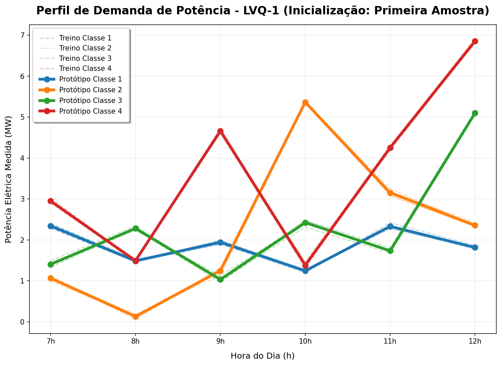
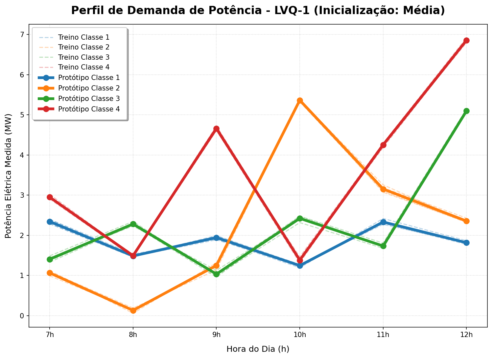

# Centro Federal de Educação Tecnológica de Minas Gerais
**Campus VIII – Varginha**  
**Bacharelado em Sistemas de Informação**  
**Disciplina:** Lab. Inteligência Artificial  
**Professor:** Lázaro Eduardo da Silva  
**Data:** 11/06/2026  
**Aluno(a):** Álvaro Henrique Duarte Mendes  
**Valor:** 100% | **Nota:** _______

---

## Atividade 10 - Classificação de Perfis de Demanda com Rede LVQ-1

Esta atividade consiste na implementação e simulação de uma rede neural **Learning Vector Quantization 1 (LVQ-1)** para a classificação de perfis diários de demanda de potência elétrica. Utiliza-se a potência medida nas primeiras 6 horas do dia (das 7h às 12h) como entrada ($x_1, \dots, x_6$) para determinar a qual das 4 classes de perfis de demanda o dia pertence. O objetivo principal é apoiar o despacho operacional e o planejamento do sistema elétrico.

### Configurações da Rede:
- **Camada de Entrada:** 6 neurônios (leituras de potência entre 7h e 12h)
- **Camada de Saída (Protótipos):** 4 neurônios (um por classe)
- **Taxa de aprendizado ($\alpha$):** 0.05, com decaimento linear ao longo de 1000 épocas:
  $$\alpha(t) = \alpha(0) \cdot \left(1 - \frac{t}{T}\right)$$
- **Inicialização de Protótipos:** Foram testados dois cenários:
  1. **Primeira Amostra:** Inicializa os protótipos com a primeira amostra de cada classe dos dados de treinamento.
  2. **Média das Amostras:** Inicializa os protótipos com o vetor médio de todas as amostras pertencentes a cada classe.
- **Número de épocas de treinamento:** 1000

---

### 1. Respostas das Questões e Classificações

#### Cenários de Inicialização e Pesos Finais
Ambos os cenários de inicialização convergiram para os mesmos protótipos finais. Isso ocorre devido à excelente separação entre as classes nos dados de treinamento: o protótipo de cada classe é sempre o vencedor para seus respectivos dados de treinamento, fazendo com que a regra de aprendizado sempre aproxime o protótipo da média do cluster.

Os vetores de pesos sinápticos finais (protótipos) obtidos são:
- **Classe 1 (Perfil Regular Baixo):** $[2.3424, 1.4871, 1.9423, 1.2456, 2.3315, 1.8150]$
- **Classe 2 (Perfil Pico de Meio Dia):** $[1.0641, 0.1305, 1.2496, 5.3629, 3.1518, 2.3546]$
- **Classe 3 (Perfil Pico de Início/Fim):** $[1.4055, 2.2810, 1.0344, 2.4214, 1.7341, 5.0960]$
- **Classe 4 (Perfil Demanda Crítica/Industrial):** $[2.9488, 1.4922, 4.6610, 1.3814, 4.2524, 6.8548]$

#### Classificação das Amostras de Teste
A tabela abaixo apresenta os resultados obtidos na classificação dos 8 dias de teste por ambas as redes (Cenários 1 e 2 são idênticos):

| Dia | 7h | 8h | 9h | 10h | 11h | 12h | Protótipo Vencedor | Classe Atribuída | Distância Euclidiana |
|:---:|:---:|:---:|:---:|:---:|:---:|:---:|:---:|:---:|:---:|
| **01** | 2.9817 | 1.5656 | 4.8391 | 1.4311 | 4.1916 | 6.9718 | Protótipo 4 | **Classe 4** | 0.2409 |
| **02** | 1.5537 | 2.2615 | 1.3169 | 2.5873 | 1.7570 | 5.0958 | Protótipo 3 | **Classe 3** | 0.3608 |
| **03** | 1.2240 | 0.2445 | 1.3595 | 5.4192 | 3.2027 | 2.5675 | Protótipo 2 | **Classe 2** | 0.3189 |
| **04** | 2.5828 | 1.5146 | 2.1119 | 1.2859 | 2.3414 | 1.8695 | Protótipo 1 | **Classe 1** | 0.3033 |
| **05** | 2.4168 | 1.4857 | 1.8959 | 1.3013 | 2.4500 | 1.7868 | Protótipo 1 | **Classe 1** | 0.1601 |
| **06** | 1.0604 | 0.2276 | 1.2806 | 5.4732 | 3.2133 | 2.4839 | Protótipo 2 | **Classe 2** | 0.2075 |
| **07** | 1.5246 | 2.4254 | 1.1353 | 2.5325 | 1.7569 | 5.2640 | Protótipo 3 | **Classe 3** | 0.2937 |
| **08** | 3.0565 | 1.6259 | 4.7743 | 1.3654 | 4.2904 | 6.9808 | Protótipo 4 | **Classe 4** | 0.2447 |

---

### 2. Perfis de Demanda e Protótipos Finais

Os gráficos a seguir apresentam os dados de treinamento (linhas tracejadas semitransparentes) comparados com os protótipos finais obtidos após o treinamento (linhas sólidas com marcadores).

#### Gráfico - Cenário 1 (Inicialização: Primeira Amostra)

#### Gráfico - Cenário 2 (Inicialização: Média)

*Os gráficos evidenciam que os protótipos se ajustam exatamente no centro das curvas de carga do treinamento de cada classe, demonstrando o comportamento correto de um quantizador vetorial supervisionado.*

---

### 3. Demonstração Matemática das Regras de Atualização da LVQ-1

A rede LVQ-1 é uma extensão supervisionada dos mapas de Kohonen que ajusta os vetores de código (protótipos) para definir as fronteiras de decisão entre classes. 

Seja $x$ um vetor de entrada pertencente à classe $y_x$, e $w_c$ o protótipo vencedor (BMU - *Best Matching Unit*) pertencente à classe $y_c$. O vetor vencedor é aquele que minimiza a distância euclidiana para $x$:
$$c = \arg\min_{i} \|x - w_i\|$$

A função de perda local a ser minimizada com respeito ao vetor $w_c$ é formulada em dois casos distintos:

#### Caso 1: Classificação Correta ($y_c = y_x$)
Neste caso, desejamos atrair o protótipo $w_c$ em direção ao padrão $x$ para reforçar sua representação. Para isso, minimizamos a função de erro quadrático clássica:
$$E = \frac{1}{2} \|x - w_c\|^2 = \frac{1}{2} \sum_{k=1}^{D} (x_k - w_{ck})^2$$

Aplicando o **Gradiente Descendente** para encontrar o ajuste do peso $w_{ck}$:
$$\Delta w_{ck} = -\alpha \frac{\partial E}{\partial w_{ck}}$$

Calculando a derivada parcial utilizando a regra da cadeia:
$$\frac{\partial E}{\partial w_{ck}} = \frac{1}{2} \cdot 2 \cdot (x_k - w_{ck}) \cdot \frac{\partial (x_k - w_{ck})}{\partial w_{ck}}$$
$$\frac{\partial E}{\partial w_{ck}} = (x_k - w_{ck}) \cdot (-1) = -(x_k - w_{ck})$$

Substituindo na expressão de ajuste de peso:
$$\Delta w_{ck} = -\alpha \left( -(x_k - w_{ck}) \right) = \alpha (x_k - w_{ck})$$

Portanto, a regra de atualização em formato vetorial para classificação correta é:
$$w_c(t+1) = w_c(t) + \alpha(t) (x - w_c(t))$$

#### Caso 2: Classificação Incorreta ($y_c \neq y_x$)
Neste caso, o protótipo incorreto foi ativado. Desejamos repelir o protótipo $w_c$ do padrão $x$ para ajustar as fronteiras de decisão. Isso equivale a maximizar a distância euclidiana, ou minimizar a função de erro negativa correspondente:
$$E = -\frac{1}{2} \|x - w_c\|^2 = -\frac{1}{2} \sum_{k=1}^{D} (x_k - w_{ck})^2$$

Aplicando o **Gradiente Descendente** para encontrar o ajuste do peso $w_{ck}$:
$$\Delta w_{ck} = -\alpha \frac{\partial E}{\partial w_{ck}}$$

Calculando a derivada parcial:
$$\frac{\partial E}{\partial w_{ck}} = -\frac{1}{2} \cdot 2 \cdot (x_k - w_{ck}) \cdot \frac{\partial (x_k - w_{ck})}{\partial w_{ck}}$$
$$\frac{\partial E}{\partial w_{ck}} = -(x_k - w_{ck}) \cdot (-1) = x_k - w_{ck}$$

Substituindo na expressão de ajuste de peso:
$$\Delta w_{ck} = -\alpha (x_k - w_{ck})$$

Portanto, a regra de atualização em formato vetorial para classificação incorreta é:
$$w_c(t+1) = w_c(t) - \alpha(t) (x - w_c(t))$$

Todos os demais protótipos não-vencedores ($i \neq c$) permanecem inalterados:
$$w_i(t+1) = w_i(t)$$

**Q.E.D. (Demonstrado)**

---

### 4. Conclusões

A rede LVQ-1 se mostrou uma solução muito eficiente e robusta para o problema de agrupamento e classificação de perfis de potência. Devido à nitidez dos clusters no espaço tridimensional das entradas, ambos os métodos de inicialização (primeira amostra vs. média das amostras) convergiram para as mesmas configurações de pesos sinápticos finais, gerando curvas representativas extremamente precisas. 

A classificação obtida para os 8 dias de teste apresentou total consistência visual com os comportamentos históricos:
- Os dias 4 e 5 representam o perfil típico da **Classe 1** (demanda regular baixa de cerca de 2 MW).
- Os dias 3 e 6 representam o perfil da **Classe 2** (pico acentuado de demanda às 10h da manhã atingindo ~5.4 MW).
- Os dias 2 e 7 representam o perfil da **Classe 3** (pico no início da noite/tarde atingindo ~5.1 MW).
- Os dias 1 e 8 representam a **Classe 4** (demanda muito elevada do início ao fim do dia, pico de 7 MW às 12h, típico de perfil industrial/comercial crítico).

Esse mapeamento automatizado via rede neural permite projetar o perfil de carga do dia inteiro tendo acesso apenas às primeiras horas, otimizando decisões de despacho e manutenção em sistemas elétricos reais.
