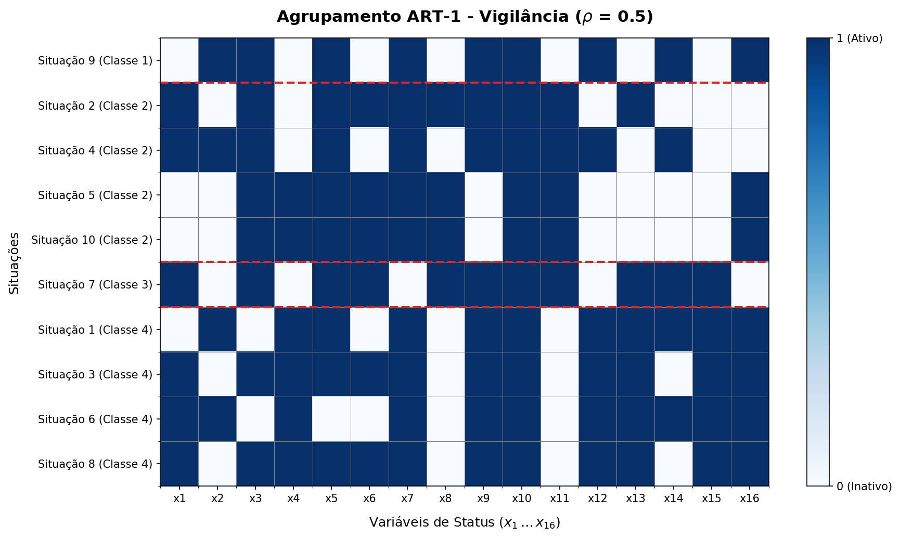
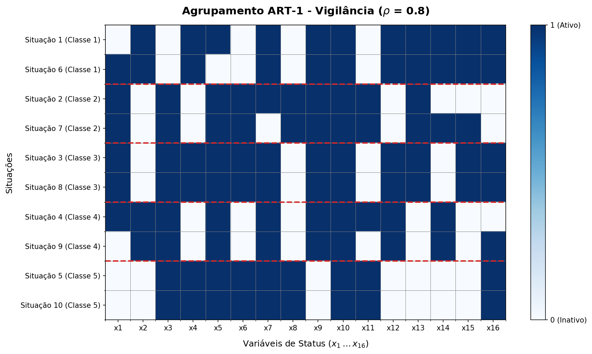
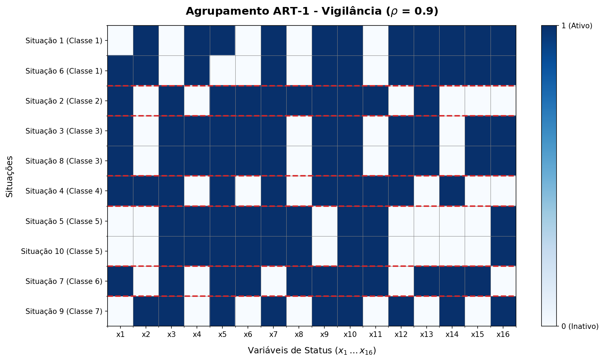
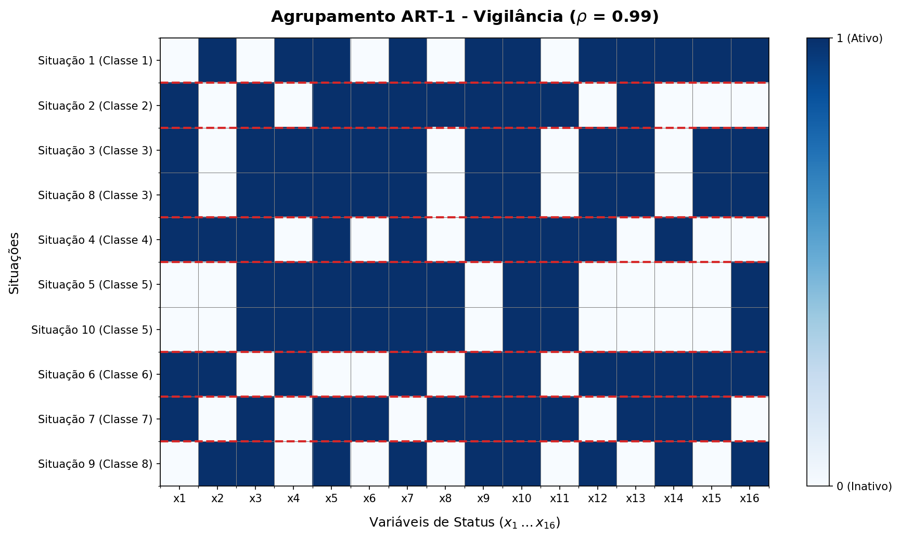

# Centro Federal de Educação Tecnológica de Minas Gerais
**Campus VIII – Varginha**  
**Bacharelado em Sistemas de Informação**  
**Disciplina:** Lab. Inteligência Artificial  
**Professor:** Lázaro Eduardo da Silva  
**Data:** 11/06/2026  
**Aluno(a):** Álvaro Henrique Duarte Mendes  
**Valor:** 100% | **Nota:** _______

---

## Atividade 11 - Agrupamento de Situações Industriais com Rede ART-1

Esta atividade consiste na implementação e simulação de uma rede neural **Adaptive Resonance Theory 1 (ART-1)** para classificar e agrupar 10 situações de comportamento de um processo industrial baseadas em 16 variáveis de status binárias ($x_1, \dots, x_{16}$). O objetivo é criar agrupamentos de comportamentos similares a fim de auxiliar no diagnóstico preditivo para eventuais ações de manutenção industrial.

A simulação é conduzida sob quatro diferentes graus de vigilância: $\rho = 0.5$, $\rho = 0.8$, $\rho = 0.9$ e $\rho = 0.99$.

### Configurações da Rede:
- **Camada de Entrada ($F_1$):** 16 neurônios (variáveis de status binárias $x_1, \dots, x_{16}$)
- **Camada de Saída ($F_2$):** Dinâmica (novas classes são geradas conforme a demanda por novos padrões)
- **Constante de Aprendizado ($L$):** 2.0 (padrão da literatura)
- **Critério de Vigilância ($\rho$):** Avaliado em 0.5, 0.8, 0.9 e 0.99
- **Condição de Parada:** Estabilização total das categorias entre épocas sucessivas de treinamento

---

### 1. Resumos e Classificações por Grau de Vigilância

Abaixo estão descritos os agrupamentos de situações industriais obtidos para cada parâmetro de vigilância $\rho$. Note que as situações idênticas (Situações 3 e 8, e Situações 5 e 10) sempre são agrupadas juntas, independentemente do valor de $\rho$.

#### Cenário A: Vigilância $\rho = 0.5$
Com baixa vigilância, a rede é tolerante a diferenças entre os padrões, resultando em menos classes (agrupamentos mais amplos e genéricos).
- **Quantidade de Classes Ativas:** 4
- **Composição dos Agrupamentos:**
  - **Classe 1:** Situação 9
  - **Classe 2:** Situação 2, Situação 4, Situação 5, Situação 10
  - **Classe 3:** Situação 7
  - **Classe 4:** Situação 1, Situação 3, Situação 6, Situação 8

#### Cenário B: Vigilância $\rho = 0.8$
Aumentando a vigilância, a rede exige maior semelhança para classificar padrões na mesma categoria, resultando em um agrupamento mais refinado.
- **Quantidade de Classes Ativas:** 5
- **Composição dos Agrupamentos:**
  - **Classe 1:** Situação 1, Situação 6
  - **Classe 2:** Situação 2, Situação 7
  - **Classe 3:** Situação 3, Situação 8
  - **Classe 4:** Situação 4, Situação 9
  - **Classe 5:** Situação 5, Situação 10

#### Cenário C: Vigilância $\rho = 0.9$
Com alta vigilância, pequenos detalhes diferenciam os grupos. Situações que antes compartilhavam classes agora formam categorias próprias.
- **Quantidade de Classes Ativas:** 7
- **Composição dos Agrupamentos:**
  - **Classe 1:** Situação 1, Situação 6
  - **Classe 2:** Situação 2
  - **Classe 3:** Situação 3, Situação 8
  - **Classe 4:** Situação 4
  - **Classe 5:** Situação 5, Situação 10
  - **Classe 6:** Situação 7
  - **Classe 7:** Situação 9

#### Cenário D: Vigilância $\rho = 0.99$
Com vigilância próxima de 100%, a rede é extremamente rígida. Situações só compartilham uma classe se forem virtualmente idênticas.
- **Quantidade de Classes Ativas:** 8
- **Composição dos Agrupamentos:**
  - **Classe 1:** Situação 1
  - **Classe 2:** Situação 2
  - **Classe 3:** Situação 3, Situação 8
  - **Classe 4:** Situação 4
  - **Classe 5:** Situação 5, Situação 10
  - **Classe 6:** Situação 6
  - **Classe 7:** Situação 7
  - **Classe 8:** Situação 9

---

### 2. Tabela de Pesos Finais (Protótipos Top-Down e Bottom-Up)

Os vetores de pesos sinápticos finais top-down ($T_j$) representam os "protótipos" binários de cada classe (vetor resultante do operador lógico AND entre os vetores da classe), enquanto os pesos bottom-up ($B_j$) fornecem a ativação e escala para a escolha da melhor unidade.

#### Tabela de Protótipos por Valor de Vigilância ($\rho$)

| Vigilância ($\rho$) | Classe | Situações Membro | Protótipo Top-Down Final ($T_j$) |
|:---:|:---:|:---|:---|
| **$\rho = 0.5$** | **Classe 1** | Situação 9 | `[0 0 0 0 0 0 1 0 1 1 0 1 0 0 0 1]` |
| | **Classe 2** | Situações 2, 4, 5, 10 | `[0 0 1 0 1 0 1 0 0 1 1 0 0 0 0 0]` |
| | **Classe 3** | Situação 7 | `[1 0 1 0 1 1 0 1 1 1 1 0 1 1 1 0]` |
| | **Classe 4** | Situações 1, 3, 6, 8 | `[0 0 0 1 0 0 1 0 1 1 0 1 1 0 1 1]` |
| **$\rho = 0.8$** | **Classe 1** | Situações 1, 6 | `[0 1 0 1 0 0 1 0 1 1 0 1 1 1 1 1]` |
| | **Classe 2** | Situações 2, 7 | `[1 0 1 0 1 1 0 1 1 1 1 0 1 0 0 0]` |
| | **Classe 3** | Situações 3, 8 | `[1 0 1 1 1 1 1 0 1 1 0 1 1 0 1 1]` |
| | **Classe 4** | Situações 4, 9 | `[0 1 1 0 1 0 1 0 1 1 0 1 0 1 0 0]` |
| | **Classe 5** | Situações 5, 10 | `[0 0 1 1 1 1 1 1 0 1 1 0 0 0 0 1]` |
| **$\rho = 0.9$** | **Classe 1** | Situações 1, 6 | `[0 1 0 1 0 0 1 0 1 1 0 1 1 1 1 1]` |
| | **Classe 2** | Situação 2 | `[1 0 1 0 1 1 1 1 1 1 1 0 1 0 0 0]` |
| | **Classe 3** | Situações 3, 8 | `[1 0 1 1 1 1 1 0 1 1 0 1 1 0 1 1]` |
| | **Classe 4** | Situação 4 | `[1 1 1 0 1 0 1 0 1 1 1 1 0 1 0 0]` |
| | **Classe 5** | Situações 5, 10 | `[0 0 1 1 1 1 1 1 0 1 1 0 0 0 0 1]` |
| | **Classe 6** | Situação 7 | `[1 0 1 0 1 1 0 1 1 1 1 0 1 1 1 0]` |
| | **Classe 7** | Situação 9 | `[0 1 1 0 1 0 1 0 1 1 0 1 0 1 0 1]` |
| **$\rho = 0.99$**| **Classe 1** | Situação 1 | `[0 1 0 1 1 0 1 0 1 1 0 1 1 1 1 1]` |
| | **Classe 2** | Situação 2 | `[1 0 1 0 1 1 1 1 1 1 1 0 1 0 0 0]` |
| | **Classe 3** | Situações 3, 8 | `[1 0 1 1 1 1 1 0 1 1 0 1 1 0 1 1]` |
| | **Classe 4** | Situação 4 | `[1 1 1 0 1 0 1 0 1 1 1 1 0 1 0 0]` |
| | **Classe 5** | Situações 5, 10 | `[0 0 1 1 1 1 1 1 0 1 1 0 0 0 0 1]` |
| | **Classe 6** | Situação 6 | `[1 1 0 1 0 0 1 0 1 1 0 1 1 1 1 1]` |
| | **Classe 7** | Situação 7 | `[1 0 1 0 1 1 0 1 1 1 1 0 1 1 1 0]` |
| | **Classe 8** | Situação 9 | `[0 1 1 0 1 0 1 0 1 1 0 1 0 1 0 1]` |

---

### 3. Funcionamento e Equações da Rede ART-1

A rede ART-1 (Adaptive Resonance Theory 1) é projetada para classificar vetores de entrada binários e resolver o **dilema da estabilidade-plasticidade**: a capacidade de aprender novos padrões (plasticidade) sem esquecer padrões aprendidos anteriormente (estabilidade).

Ela é composta por duas camadas principais ligadas por conexões de feedback (top-down) e feedforward (bottom-up):
- **Camada de Comparação ($F_1$):** Recebe o sinal de entrada e o compara com o protótipo da classe selecionada.
- **Camada de Reconhecimento ($F_2$):** Executa uma competição do tipo *"winner-takes-all"* para determinar a categoria que melhor representa a entrada.

#### 1. Cálculo de Ativação (Camada $F_2$)
Dado um vetor de entrada binário $x \in \{0, 1\}^N$, a ativação $y_j$ de cada neurônio $j$ na camada $F_2$ (categoria) é calculada por:
$$y_j = \sum_{i=1}^{N} b_{ij} x_i$$

Para unidades ainda não associadas a nenhuma classe (unidades não-comprometidas), os pesos bottom-up são inicializados como:
$$b_{ij}(0) = \frac{L}{L - 1 + N}$$

O que gera uma ativação padrão de linha de base para novas categorias:
$$y_{\text{uncommitted}} = \frac{L \cdot |x|}{L - 1 + N}$$

onde $|x| = \sum_{i=1}^N x_i$ denota a norma $L_1$ do vetor (número de bits ativos).

#### 2. Escolha da Unidade Vencedora (Competição)
Seleciona-se o neurônio $J$ ativo em $F_2$ com maior ativação:
$$J = \arg\max_{j \text{ ativo}} y_j$$

#### 3. Teste de Vigilância (Ressonância vs. Inibição)
Após escolher o neurônio vencedor $J$, o padrão armazenado no protótipo top-down $t_J$ (com pesos iniciais $t_{ji}(0) = 1$) é comparado com o sinal de entrada na camada $F_1$. O teste de vigilância verifica se a similaridade atinge o limiar $\rho$:
$$\frac{|x \odot t_J|}{|x|} \ge \rho$$

onde $\odot$ representa o produto elementar (operador lógico AND).
- Se a condição for atendida, ocorre **ressonância**. O padrão é atribuído à categoria $J$ e os pesos são atualizados.
- Se a condição falhar, o neurônio $J$ é **inibido** (desativado temporariamente para o padrão atual, $y_J = -1$), e o processo de busca reinicia para escolher a próxima melhor unidade ativa em $F_2$. Se todas as unidades comprometidas falharem no teste, a unidade não-comprometida é selecionada, tornando-se uma nova classe.

#### 4. Regra de Aprendizado
Quando ocorre a ressonância para uma unidade $J$, seus pesos são atualizados seguindo a regra de aprendizado rápido (*fast learning*):

- **Pesos Top-Down ($T_J$):**
  $$t_{Ji}^{(new)} = x_i \cdot t_{Ji}^{(old)}$$

- **Pesos Bottom-Up ($B_J$):**
  $$b_{iJ}^{(new)} = \frac{L \cdot (x_i \cdot t_{Ji}^{(old)})}{L - 1 + \sum_{k=1}^N x_k \cdot t_{Jk}^{(old)}}$$

---

### 4. Discussões e Conclusões

1. **Efeito do Parâmetro de Vigilância ($\rho$):**
   A vigilância atua diretamente na resolução taxonômica da classificação:
   - **Baixo $\rho$ ($\rho = 0.5$):** Agrupamento muito amplo (4 classes). Situações com consideráveis diferenças são postas no mesmo cluster.
   - **Alto $\rho$ ($\rho = 0.99$):** Agrupamento extremamente estrito (8 classes). Apenas situações de equivalência perfeita compartilham categorias.

2. **Diferenciação e Resolução Dinâmica:**
   Note que a rede ajusta de maneira ideal a quantidade de classes ativas: 4, 5, 7 e 8 classes. Os resultados evidenciam a versatilidade de classificar status operacionais industriais sem a necessidade de rotulação prévia dos dados, sendo extremamente útil para o monitoramento contínuo de sistemas em tempo real.
